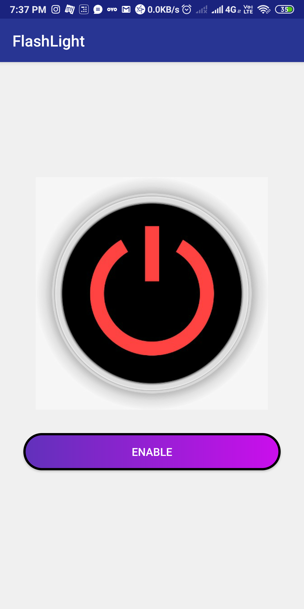

# About
### App used to make the device flashlight on and off.

## Screenshot

## Tech Stack
#### It uses an additional user-permission to access device flashlight by clicking on the Enable button as shown in the above image.